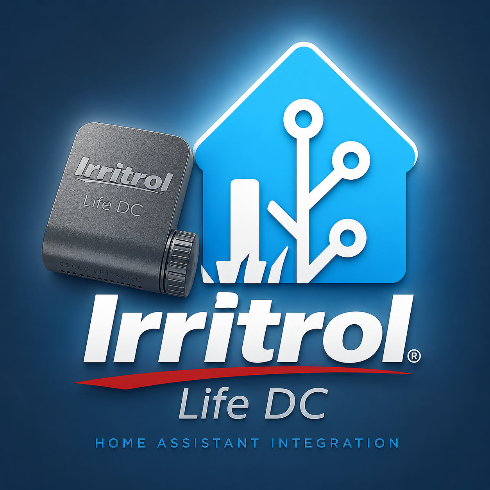
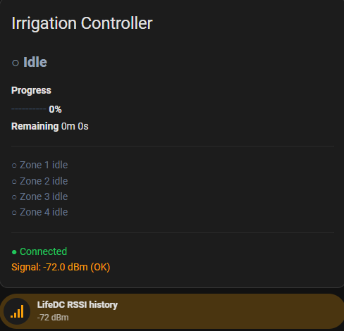
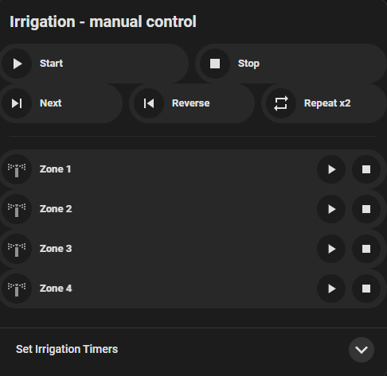
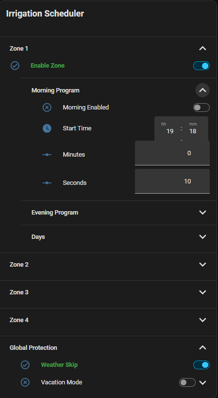
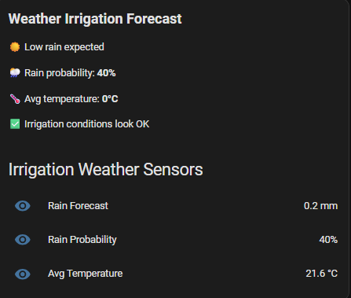

# Irritrol LifeDC for Home Assistant

<p align="center">
  
</p>

<p align="center">
  A local Home Assistant integration and automation package for the Irritrol LifeDC BLE irrigation controller.
</p>

<p align="center">
  <strong>Home Assistant</strong> · <strong>ESPHome</strong> · <strong>BLE</strong> · <strong>Irrigation automation</strong>
</p>

---

## Overview

`ha-irritrol-lifedc` provides a local Home Assistant setup for controlling an Irritrol LifeDC irrigation controller.

The project is designed around a practical, production-style Home Assistant workflow:

- local Irritrol LifeDC control;
- zone runtime configuration;
- manual control cards;
- scheduled irrigation;
- weather-aware skip logic;
- daily runtime history;
- dashboard examples;
- HACS-compatible custom integration structure.

The integration domain and default entity prefix are:

```text
irritrol_lifedc
```

Typical generated entities look like:

```text
button.irritrol_lifedc_run_zone_1
switch.irritrol_lifedc_zone_1
number.irritrol_lifedc_zone_1_minutes
sensor.irritrol_lifedc_status
```

---

## Screenshots

### Irrigation status



### Manual control



### Irrigation scheduler



### Weather irrigation forecast



---

## Architecture

```text
Irritrol LifeDC controller
        ⇅ BLE
Home Assistant custom integration
        ⇅
Entities / dashboards / packages / automations
```

The project keeps irrigation logic in Home Assistant while exposing the controller through normal HA entities.

Optional package files provide:

- scheduler helpers;
- morning/evening programs;
- day-of-week enable flags;
- vacation mode;
- weather skip logic;
- daily runtime statistics.

---

## Features

- Local BLE-based Irritrol LifeDC control
- Four-zone irrigation support
- Manual zone start/stop
- Cycle start 1→4 and 4→1
- Repeat cycle actions
- Next zone action
- Pause/resume/stop support
- Zone minutes and seconds configuration
- Inter-zone delay configuration
- RSSI and BLE metadata sensors
- Status and progress sensors
- Optional irrigation scheduler package
- Optional weather forecast package
- Lovelace dashboard examples
- HACS-ready repository layout

---

## Repository structure

```text
custom_components/
  irritrol_lifedc/
examples/
images/
packages/
hacs.json
README.md
LICENSE
```

### Main folders

| Folder | Purpose |
|---|---|
| `custom_components/irritrol_lifedc` | Home Assistant custom integration |
| `packages` | Optional HA packages for scheduler and weather logic |
| `examples` | Lovelace dashboard YAML examples |
| `images` | README and dashboard screenshots |

---

## Installation with HACS

1. Open HACS.
2. Go to **Integrations**.
3. Add this repository as a custom repository:

```text
https://github.com/cristtiann/ha-irritrol-lifedc
```

4. Category: `Integration`.
5. Install **Irritrol LifeDC**.
6. Restart Home Assistant.
7. Add the integration from **Settings → Devices & services → Add integration**.

---

## Manual installation

Copy this folder:

```text
custom_components/irritrol_lifedc
```

into:

```text
/config/custom_components/irritrol_lifedc
```

Then restart Home Assistant.

---

## Packages

The `packages` folder is optional, but recommended if you want the full irrigation workflow.

It contains:

```text
packages/irrigation_schedule.yaml
packages/irrigation_weather.yaml
```

To enable packages, add this to `configuration.yaml` if you do not already have it:

```yaml
homeassistant:
  packages: !include_dir_named packages
```

Then copy the package files into:

```text
/config/packages/
```

Restart Home Assistant.

### `irrigation_schedule.yaml`

Provides:

- scheduler enable helpers;
- morning/evening programs;
- runtime minutes and seconds;
- day-of-week selection;
- vacation runtime reduction;
- finished notifications;
- daily runtime history sensors.

### `irrigation_weather.yaml`

Provides:

- rain amount forecast for the next 12h;
- rain probability forecast for the next 12h;
- average temperature forecast for the next 12h;
- automatic weather skip helper.

The weather package uses Home Assistant's `weather.get_forecasts` service and stores values in helper entities before exposing template sensors.

---

## Dashboard examples

Example Lovelace YAML files are available in:

```text
examples/
```

The screenshots above are based on these dashboard concepts:

- controller status;
- manual zone control;
- scheduler card;
- runtime and history;
- weather forecast card.

Some examples use custom Lovelace cards such as:

- `bubble-card`;
- `fold-entity-row`;
- `vertical-stack-in-card`;
- `card-mod`.

Install those separately through HACS if you want the same visual layout.

---

## BLE protocol notes

This integration communicates locally with the Irritrol LifeDC controller using reverse-engineered BLE communication.

The project currently supports:

- local BLE communication;
- zone control;
- cycle execution;
- pause/resume/stop actions;
- ACK-based command handling;
- configurable command timing.

If your controller variant uses a different BLE command profile, open the integration options and adjust the BLE command settings accordingly.

---

## Known limitations

BLE behavior can vary depending on:

- ESP32 board quality;
- Bluetooth adapter/proxy routing;
- distance and antenna placement;
- controller firmware variant;
- Home Assistant Bluetooth stack behavior.

For best stability, test manual zone commands several times before relying on scheduled irrigation.

---

## Backup recommendation

Before major changes:

1. Confirm manual zone start works.
2. Confirm stop works.
3. Confirm scheduler triggers correctly.
4. Confirm weather sensors update.
5. Create a full Home Assistant backup.

---

## Roadmap

Possible future improvements:

- multi-controller support;
- richer diagnostics;
- native water usage estimation;
- better BLE route visibility;
- improved onboarding guide;
- additional dashboard themes.

---

## Credits

Created by Cristian Gheorghe / ETTC Solutions.

Repository:

```text
https://github.com/cristtiann/ha-irritrol-lifedc
```

---

## License

MIT License.
